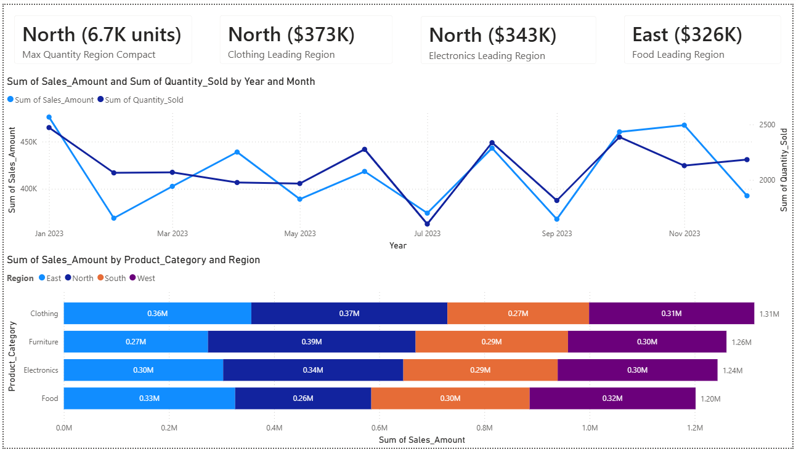
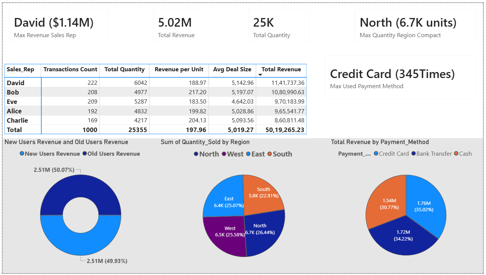

# SQL + Power BI Sales Data Analysis Project

## 📌 Project Overview

This project focuses on cleaning, analyzing, and visualizing sales data using MySQL and Power BI. The dataset contains transaction-level information including product details, sales representatives, regions, revenue, quantity sold, customer type, discounts, payment methods, and sales channels.

The objective of this project was to:

* Clean and standardize raw sales data
* Validate data quality using business rules
* Perform exploratory data analysis (EDA) to uncover trends
* Build interactive dashboards to present insights

---

## 🛠️ Tools & Technologies

* MySQL
* MySQL Workbench
* Power BI

---

## 🧹 Data Cleaning (SQL)

The raw dataset contained inconsistencies and data quality issues. The following steps were performed:

* Created a staging table to preserve original data
* Identified duplicate records using `ROW_NUMBER()`
* Checked and handled null values in key columns.
* Standardized categorical fields
* Converted `Sale_Date` from text to `DATE` format
* Rounded numeric fields (`Sales_Amount`, `Unit_Cost`, `Unit_Price`, `Discount`)
* Applied business validations:

  * Ensured `Unit_Price ≥ Unit_Cost`
  * Verified `Discount` is between 0 and 1
  * Ensured `Quantity_Sold` is non-negative
* Removed unnecessary column `Region_and_Sales_Rep`

---

## 📊 Exploratory Data Analysis (SQL)

Performed SQL-based analysis to extract key business insights:

### 🔹 Key Analyses:

* Total revenue, total quantity sold, and average order value
* Profit estimation using `(Unit_Price - Unit_Cost) × Quantity_Sold`
* Sales trends by year and month
* Top-performing products and categories
* Region-wise sales distribution
* Sales representative performance
* Revenue by customer type
* Payment method and sales channel analysis
* Impact of discount on profitability

---

## 📈 Power BI Dashboard

The cleaned dataset was visualized using Power BI to create interactive dashboards for sales performance analysis.

### 🔹 Dashboard Features:

* KPI cards (Total Revenue, Total Quantity, Top Sales Rep, Leading Region)
* Monthly revenue and quantity trend analysis
* Product category and region-wise sales comparison
* Sales representative performance table
* Customer type revenue distribution
* Quantity sold by region
* Revenue breakdown by payment method

### 🔹 Dashboard Preview:

#### Sales Overview Dashboard



#### Sales Performance Dashboard



---

## 📁 Project Structure

```text
sales-data-analysis-sql-powerbi/
│
├── data/
│   ├── sales_data_raw.csv
│   └── sales_data_cleaned.csv
│
├── sql/
│   ├── sales_data_cleaning.sql
│   └── sales_eda.sql
│
├── powerbi/
│   └── sales_dashboard.pbix
│
├── images/
│   ├── sales_dashboard_overview.png
│   └── sales_dashboard_details.png
│
├── README.md
├── setup.md
└── insights.md
```

---

## 📂 Dataset Columns

* Product_ID
* Sale_Date
* Sales_Rep
* Region
* Sales_Amount
* Quantity_Sold
* Product_Category
* Unit_Cost
* Unit_Price
* Customer_Type
* Discount
* Payment_Method
* Sales_Channel

---

## 🔄 Before vs After Cleaning

| Aspect            | Raw Data     | Cleaned Data |
| ----------------- | ------------ | ------------ |
| Duplicates        | Present      | Removed      |
| Date Format       | Text         | Proper DATE  |
| Null Values       | Present      | Handled      |
| Numeric Precision | Inconsistent | Standardized |
| Data Quality      | Inconsistent | Improved     |

---

## 🎯 Key Insights

* Sales trends show clear variation across months, indicating seasonal patterns
* Certain regions contribute significantly more to total revenue
* A small number of products drive a large portion of sales
* Discount levels directly impact profitability
* Customer type and sales channel influence revenue distribution

---

## 🚀 Outcome

The dataset was transformed into a clean, structured, and analysis-ready format and further visualized through interactive dashboards.

This project demonstrates:

* Strong SQL data cleaning and transformation skills
* Practical exploratory data analysis (EDA)
* Ability to build business-focused dashboards in Power BI
* Understanding of key metrics such as revenue, profit, and trends

---

## 👤 Author

**Rishi Raj**
